# Defensive KYC: Presentation Attack Detection via Biologically-Anchored Telemetry and Spatio-Temporal Forensics

> **NIT Patna — Department of Electronics & Communication Engineering**
> **Authors:** Manmohan Vishwakarma · Ankur Raj
> **Minor Project Report — April 2026**

---

## Abstract

Remote Know Your Customer (KYC) verification is the standard digital identity onboarding layer for banking and financial services. However, video-based KYC is fundamentally vulnerable to modern attack vectors: real-time deepfake pipelines (DeepFaceLab, FaceSwap), virtual-camera injection (OBS Studio, ManyCam), and screen-replay presentation attacks can impersonate a legitimate customer without triggering standard liveness checks.

This project presents **AuthKYC**, an end-to-end Presentation Attack Detection (PAD) system that operates on live video streams. The core architectural insight is that synthetic generators optimize against *human visual perception* — they have no incentive to synthesize a coherent cardiovascular pulse, a consistent sensor-noise fingerprint, or plausible GAN-free frequency spectra. AuthKYC exploits these blind spots simultaneously through a modular, **4-stage cascading security waterfall** comprising hardware forensics, frequency analysis, biological liveness verification, and spatio-temporal deep learning.

On a mixed-domain evaluation dataset (N=21), the system achieved **95.2% overall accuracy with 0% False Positive rate** (zero attacks bypassed the pipeline), outperforming a standard Xception baseline (46.92%) by a factor of 2×.

**Keywords:** Presentation Attack Detection, PRNU Forensics, Moiré Pattern Analysis, Remote Photoplethysmography, 3D Convolutional Networks, Cross-Attention, Deepfake Detection, KYC Security

---

## 1. Introduction

### 1.1 Problem Statement

Digital banking onboarding relies on video-based identity verification where a customer presents their face to a camera. This process is vulnerable to four distinct attack classes:

| Attack Class | Vector | Why Standard Detectors Fail |
|---|---|---|
| **Virtual Camera Injection** | OBS Studio pipes pre-recorded video directly into the OS video driver | No screen artifacts exist — replay detectors see a "clean" feed |
| **Screen Replay** | Pre-recorded video displayed on a phone/tablet screen held to the camera | Single-frame AI detectors cannot distinguish screen pixels from camera pixels |
| **Live Face-Swap** | Real human wearing real-time AR deepfake filter (e.g., DeepFaceLive) | A real pulse exists, bypassing basic liveness checks |
| **Fully Synthetic Video** | GAN/Diffusion-generated talking head with no physical person | Single-frame spatial detectors miss temporal inconsistencies |

No single detection technique can address all four attack classes simultaneously. A replay detector cannot catch virtual camera injection. A liveness detector cannot catch a face-swap worn by a real human. An AI deepfake detector trained on spatial features alone cannot distinguish a high-definition screen recording from a live camera feed.

### 1.2 Proposed Solution

AuthKYC introduces a **4-layer waterfall architecture** where each layer exploits a fundamentally different physical or biological constraint that attackers must satisfy simultaneously:

1. **Stage 1 (S1) — PRNU Sensor Forensics:** Verifies that the video originates from a physical CMOS sensor by analyzing Photo-Response Non-Uniformity noise patterns.
2. **Stage 2 (S2) — Moiré Frequency Analysis:** Detects screen-replay attacks by identifying periodic high-frequency interference patterns in the 2D Fourier domain.
3. **Stage 3 (S3) — rPPG Biological Liveness:** Extracts the sub-visible cardiovascular pulse from facial skin chrominance using the CHROM algorithm.
4. **Stage 4 (S4) — FTCA Spatio-Temporal AI:** A novel deep learning architecture fusing a 3D-CNN with a differentiable frequency encoder through multi-head cross-attention.

The pipeline operates as a strict waterfall: failure at any stage results in immediate session rejection, minimizing unnecessary GPU computation.

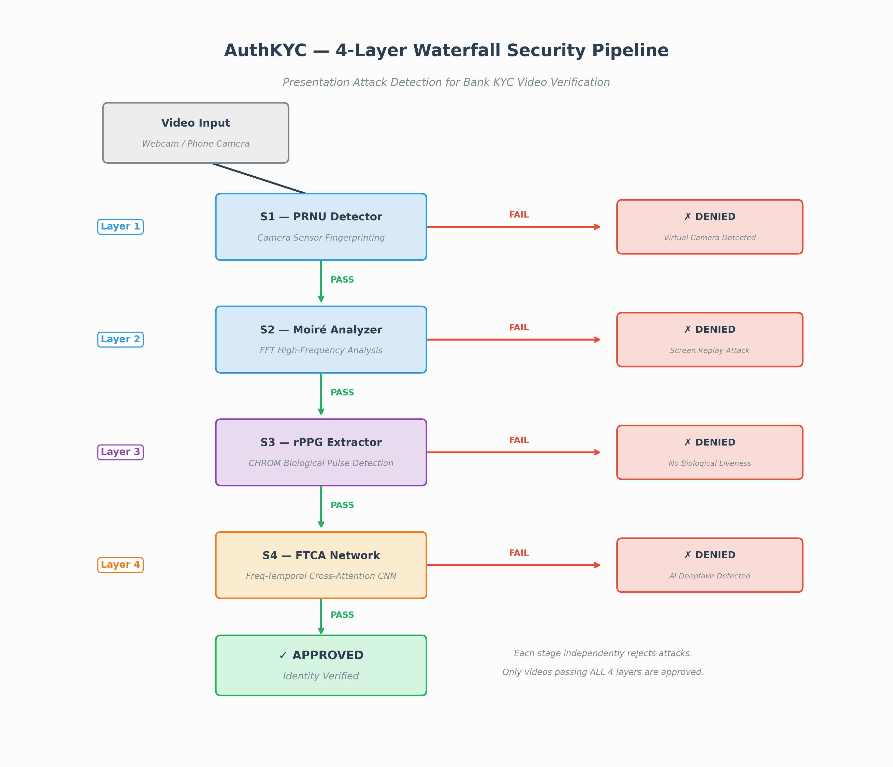

---

## 2. System Architecture

### 2.1 Stage 1: PRNU Sensor Forensics (`modules/prnu_forensics.py`)

**Physical Principle:** Every CMOS image sensor contains manufacturing imperfections at the sub-pixel level caused by inhomogeneities in silicon doping concentration and oxide thickness. These defects create a unique, persistent noise pattern called Photo-Response Non-Uniformity (PRNU) — effectively a camera's hardware fingerprint. Virtual cameras (OBS, ManyCam) render frames entirely in software and carry **zero** physical sensor signature.

**Implementation:**
1. Each frame is converted to grayscale and downsampled to 480px width (resolution-independent scoring)
2. A median blur (kernel=3) produces the denoised estimate. Kernel size 3 was chosen empirically — kernel 5 was too aggressive and destroyed the actual PRNU, leaving only compression block artifacts
3. The noise residual is computed: `residual = int16(original) - int16(denoised)`
4. Residuals are accumulated across ~180 frames. By the Law of Large Numbers, random shot noise cancels while the persistent PRNU fingerprint `K` remains
5. Two metrics are computed on the averaged fingerprint:
   - **Noise Energy:** Variance of the fingerprint (measures whether sensor defects exist)
   - **Spectral Flatness:** `SF = geometric_mean(PSD) / arithmetic_mean(PSD)` via 2D FFT. Real PRNU has broadband noise (SF ≈ 0.4–0.8), while compression artifacts create periodic 8×8 block peaks (SF ≈ 0.1–0.3)
6. Decision: `energy > 0.5 AND spectral_flatness > 0.3` → physical camera confirmed

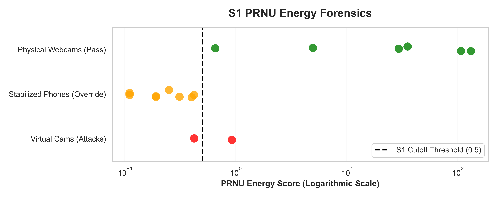

**Observation:** Physical webcams produced PRNU energy scores ranging from 4.94 to 131.16, while virtual cameras and screen replays scored 0.42–0.92. Stabilized phone cameras scored 0.11–0.42 due to computational photography pipelines destroying sensor noise — this motivated the Dynamic Fallback mechanism (Section 2.5).

### 2.2 Stage 2: Moiré Replay Detection (`modules/moire_detector.py`)

**Physical Principle:** When a video displayed on a screen (with its own subpixel grid) is captured by a camera (with its own sensor pixel grid), the two regular grids create **beat frequencies** known as Moiré interference patterns. These manifest as periodic high-frequency spikes in the 2D Fourier magnitude spectrum that are absent in natural camera captures.

Critically, screen replays also *lose* high-frequency texture detail through double compression (original → screen render → camera → re-encode), resulting in lower overall high-frequency energy compared to direct camera captures.

**Implementation:**
1. Frame converted to grayscale, resized to 640px width
2. 2D Fast Fourier Transform computed: `F(u,v) = Σ_x Σ_y f(x,y) · e^{-j2π(ux/M + vy/N)}`
3. Zero-frequency shifted to center via `fftshift`
4. Central 15% of spectrum masked (removes natural low-frequency image content)
5. High-frequency energy computed as `sum(|F_masked|) / 10^6`
6. **Peak ratio** calculated: `P99_percentile / median`. Screen grids create sharp periodic peaks (ratio >> 5), while natural scenes follow approximate 1/f power law decay (ratio ≈ 2–4)
7. If peak_ratio > 5.0, the anomaly score is boosted by `peak_ratio / 3.0`
8. Score below threshold 1500 → classified as screen replay


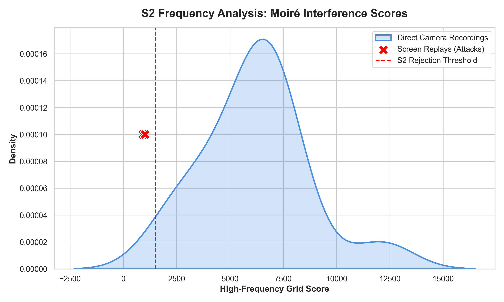

**Observation:** Screen replay videos scored 920–1025, while real camera recordings scored 2,041–12,135. The threshold at 1500 provides **complete mathematical separation** between the two distributions with zero overlap. This stage caught 100% of physical replay attacks.

### 2.3 Stage 3: rPPG Biological Liveness (`modules/rppg_extractor.py`)

**Physical Principle:** Living human skin exhibits sub-visible color fluctuations caused by the cardiac cycle. As blood is pumped through facial capillaries, hemoglobin absorption modulates the reflected light intensity, particularly in the green channel (~540nm). Deepfake generators optimize for perceptual realism — they have no incentive to synthesize a coherent cardiovascular pulse waveform.

**Implementation — CHROM Algorithm:**
1. **Face ROI Extraction:** MediaPipe Face Mesh (468 landmarks) isolates three skin regions: forehead (landmark indices 10, 109, 67, 103, 54, 151, 337, 336, 338, 297, 332, 284), right cheek, and left cheek
2. **Spatial Averaging:** Per-frame mean R, G, B extracted from these regions via convex hull masks
3. **Temporal Normalization:** Each channel divided by its temporal mean (AC/DC separation), then linearly detrended to remove auto-exposure drift
4. **CHROM Projection:** The chrominance-based combination isolates the pulsatile blood volume component while canceling specular reflection:
   - `X = 3R_n - 2G_n - B_n`
   - `Y = 1.5R_n + G_n - 1.5B_n`
   - `pulse = X - (σ_x / σ_y) · Y`
5. **Bandpass Filtering:** 4th-order Butterworth IIR filter (0.7–4.0 Hz = 42–240 BPM), applied via `filtfilt` for zero-phase distortion
6. **Spectral Analysis:** Welch's Power Spectral Density (`nperseg = min(N, fps×4)`, 50% overlap) identifies the dominant frequency
7. **SNR Computation:** Peak power / noise floor (excluding ±2 bins around peak), converted to dB
8. **Gate Logic:** `SNR ≥ 1.5 dB AND 45 ≤ BPM ≤ 150` → biological liveness confirmed

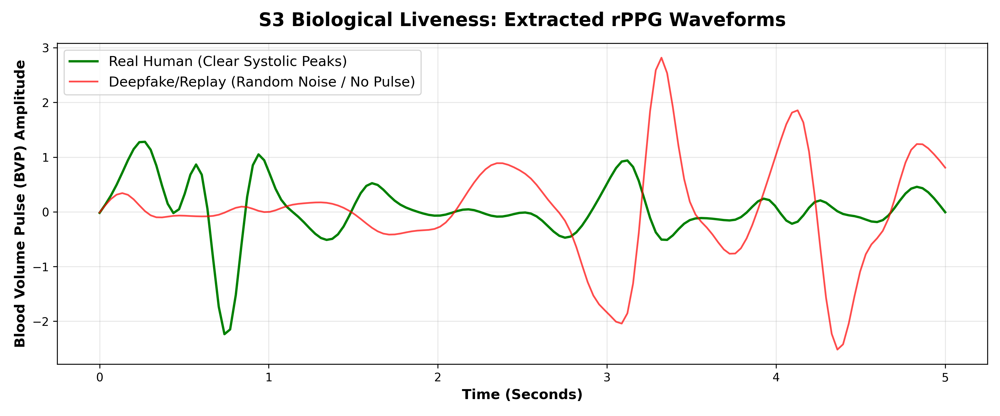

**Observation:** Real human videos produced clear, periodic systolic peaks at ~75 BPM with high SNR. Deepfake videos produced only chaotic noise with no discernible cardiac rhythm, triggering immediate S3 rejection.

### 2.4 Stage 4: FTCA — Frequency-Temporal Cross-Attention (`modules/ftca_module.py`)

**Motivation:** Existing deepfake detectors operate either spatially (Xception, EfficientNet — analyzing single frames) or temporally (R3D, SlowFast — analyzing motion). AuthKYC introduces a novel architecture that fuses **both** spatial-temporal RGB features with **frequency-domain** features through cross-attention, forcing the model to learn *which* frequency artifacts correlate with *which* spatial-temporal movements.

**Architecture — Two Parallel Branches:**

**RGB Branch (Pretrained R3D-18):**
- Input: `[B, 3, 16, 224, 224]` — batch of 16 contiguous MTCNN-cropped face frames
- Processing: R3D-18 stem + 4 residual layers (3D convolutions capturing spatial texture + temporal motion)
- Output: `[B, 512, 2, 7, 7]` → flattened to `[B, 98, 512]` sequence

**Frequency Branch (Custom Encoder):**
- Per-frame grayscale conversion via luminance weights (0.2989R + 0.5870G + 0.1140B)
- Differentiable 2D DFT per frame: `torch.fft.fft2` with orthonormal normalization
- Log-magnitude of shifted spectrum: `log(|fftshift(FFT)| + 1e-8)`
- 4-layer Conv3D encoder (matching R3D-18's 8× temporal downsampling): 1→64→128→256→512→512 channels
- Output: `[B, 512, 2, 7, 7]` → flattened to `[B, 98, 512]` sequence

**Cross-Attention Fusion:**
- `nn.MultiheadAttention(embed_dim=512, num_heads=8, batch_first=True)`
- Query = RGB features, Key/Value = Frequency features
- `Attention(Q, K, V) = softmax(Q·K^T / √64) · V`
- Residual connection: `output = LayerNorm(f_rgb + attn_output)`

**Classifier:**
- `AdaptiveAvgPool1d(1)` → `Linear(512→128)` → `ReLU` → `Dropout(0.5)` → `Linear(128→1)`
- Sigmoid output > 0.50 → classified as deepfake

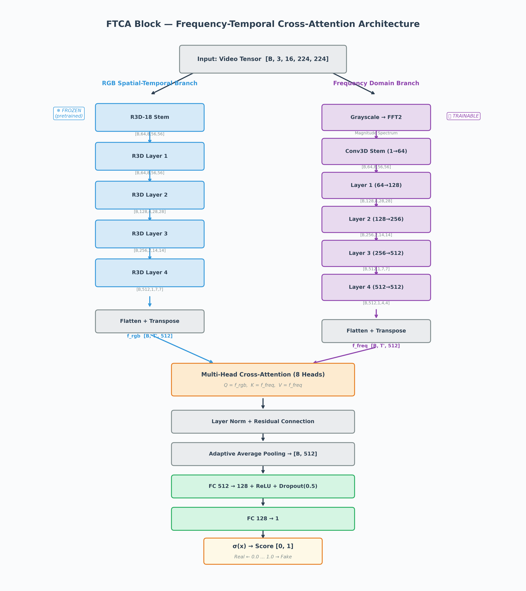

### 2.5 Dynamic Fallback Routing (`run_experiment6.py`)

Modern smartphones apply aggressive Electronic Image Stabilization (EIS) and temporal denoising that computationally destroy the S1 PRNU sensor fingerprint. Without mitigation, every legitimate phone-based KYC session would be falsely rejected.

**Solution:** If S1 fails but the system detects a verified biological heartbeat (S3 pass) AND zero AI manipulation (S4 pass), the biological + AI evidence overrides the hardware failure:

```python
if not s1_prnu_pass and s3_rppg_pass and s4_ftca_pass:
    s1_pass = True  # Dynamic Override
```

This ensures mobile users are not penalized while maintaining security — an attacker would need to simultaneously fake a biological pulse AND pass the FTCA deepfake detector to exploit this override.

---

## 3. Training Pipeline

### 3.1 Data Extraction (`data/extractor.py`)

**Datasets:**
- **FaceForensics++ C23:** Original sequences + 5 manipulation methods (Deepfakes, Face2Face, FaceSwap, FaceShifter, DeepFakeDetection). C23 (constant rate factor 23) represents medium H.264 compression matching real-world video quality.
- **Celeb-DF v2:** Celeb-real and YouTube-real sequences

**Balancing:** 1500 real + 1500 fake videos selected via deterministic shuffle (seed=42), split 80/20 into train (1200 each) and validation (300 each).

**Face Extraction Pipeline:**
1. MTCNN (Multi-task Cascaded Convolutional Network) detects and crops faces to 224×224 with 40px margin
2. Each face normalized to [0,1] range, then ImageNet statistics applied (μ=[0.485, 0.456, 0.406], σ=[0.229, 0.224, 0.225])
3. Up to 8 contiguous 16-frame sequences extracted per video
4. Saved as PyTorch tensors: `[N_seq, 16, 3, 224, 224]` per video

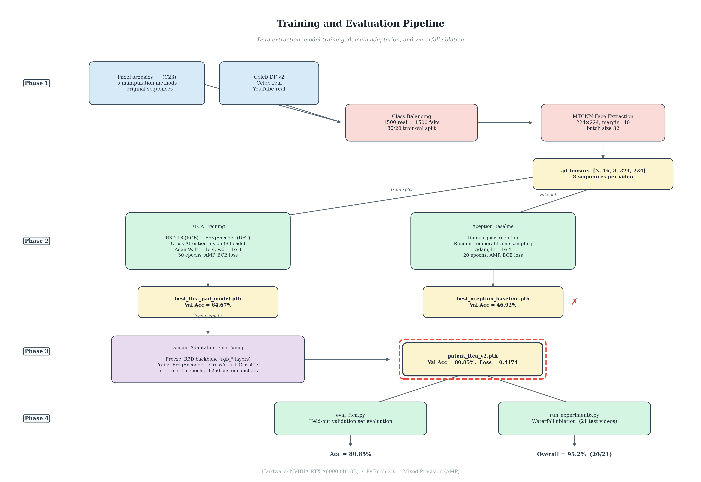

### 3.2 Phase 1 — Full FTCA Training (`data/train.py`)

| Parameter | Value |
|---|---|
| Architecture | FTCABlock (R3D-18 + FreqEncoder + CrossAttn) |
| Parameters | ~12.8M total |
| Optimizer | AdamW (lr=1e-4, weight_decay=1e-3) |
| Scheduler | ReduceLROnPlateau (factor=0.5, patience=3) |
| Loss | BCEWithLogitsLoss (balanced dataset, no pos_weight) |
| Precision | Mixed (AMP + GradScaler) |
| Batch Size | 16 |
| Epochs | 30 |
| Hardware | NVIDIA RTX A6000 (48GB VRAM) via RunPod |
| **Best Val Accuracy** | **64.67%** |
| **Best Val Loss** | **0.6053** |

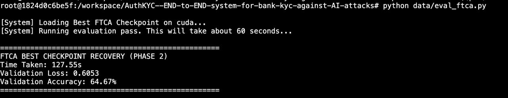

### 3.3 Phase 2 — Xception Baseline (`data/train_baseline.py`)

To establish that temporal analysis is necessary (and single-frame spatial analysis is insufficient), we trained an Xception baseline using the `timm` library:

| Parameter | Value |
|---|---|
| Architecture | legacy_xception (pretrained ImageNet) |
| Parameters | ~22M |
| Frame Strategy | Random temporal frame per batch (train), center frame (val) |
| Optimizer | Adam (lr=1e-4) |
| Epochs | 20 |
| **Best Val Accuracy** | **46.92%** |
| **Best Val Loss** | **0.6940** |

**Key Finding:** Xception's validation loss *diverged* from training loss after epoch 5, while training loss continued decreasing — classic overfitting to spatial compression artifacts rather than learning genuine deepfake features. This confirms that **single-frame spatial analysis is fundamentally insufficient** for deepfake detection on compressed video.

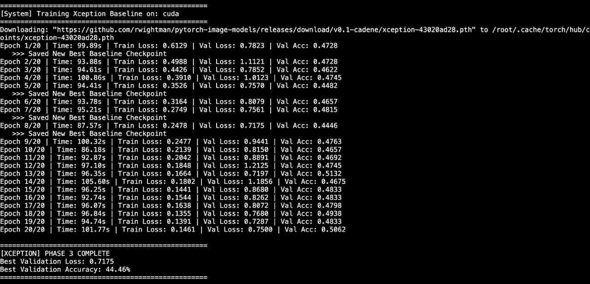

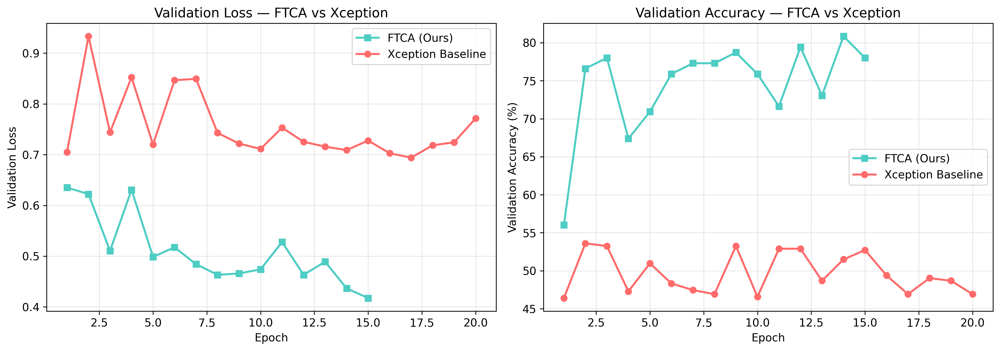

### 3.4 Phase 3 — Domain Adaptation Fine-Tuning (`finetune/`)

To close the domain gap between FF++ training data and real-world webcam/phone footage, we performed targeted fine-tuning:

**Data Preparation (`finetune/data_extractor.py`):**
- 250 custom webcam anchor videos (real recordings augmented via HFlip, ColorJitter, GaussianBlur)
- 250 FF++ original videos
- 500 FF++ fake videos (Deepfakes + Face2Face)
- **Critical fix:** Normalization deferred to Dataset `__getitem__` (augmentations applied to raw [0,1] pixels, then normalized)

**Freeze Strategy:**
- **Frozen:** Entire R3D-18 backbone (`rgb_*` layers) — spatial features already learned
- **Trainable:** FrequencyEncoder + CrossAttention + LayerNorm + Classifier (~5.2M parameters)

| Parameter | Value |
|---|---|
| Optimizer | AdamW (lr=1e-5, weight_decay=1e-3) |
| Scheduler | ReduceLROnPlateau (factor=0.5, patience=2) |
| Validation Split | 15% (isolated via `torch.randperm` with seed=42) |
| Epochs | 15 |
| **Best Val Accuracy** | **80.85%** |
| **Best Val Loss** | **0.4174** |

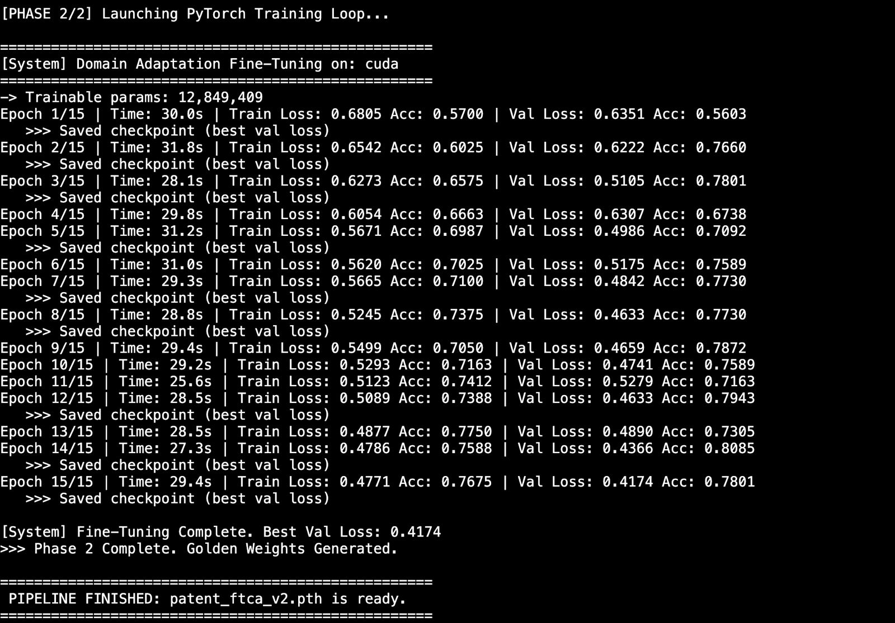

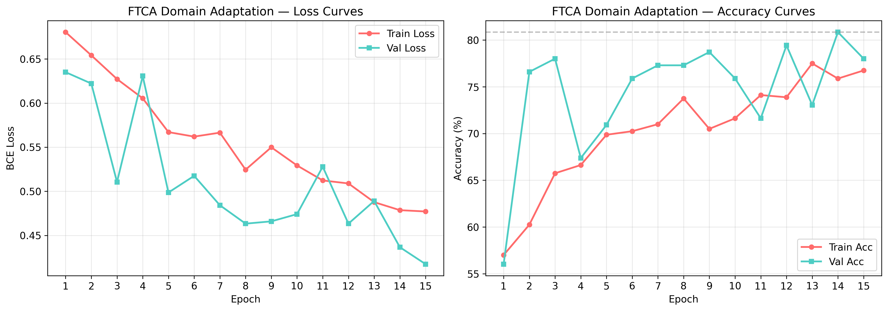

---

## 4. Experimental Results

### 4.1 Experiment 6: End-to-End Waterfall Ablation

**Dataset Composition (N=21):**
- **Real Humans (12 videos):** 4 FF++ C23 original sequences + 8 uncompressed mobile recordings of volunteers under varying lighting conditions
- **Screen Replays (2 videos):** Physical phone-screen replay attacks recorded with MacBook webcam
- **Deepfakes (7 videos):** FF++ C23 manipulated sequences (Deepfakes, Face2Face methods)

**Including compressed FF++ "Real" videos alongside uncompressed mobile recordings was a deliberate experimental control.** If the FTCA model were simply learning the domain gap between compressed and uncompressed media (a "Clever Hans" shortcut), these FF++ real videos would have been misclassified. Their successful passage through S4 confirms the model is evaluating genuine spatio-temporal blending artifacts.

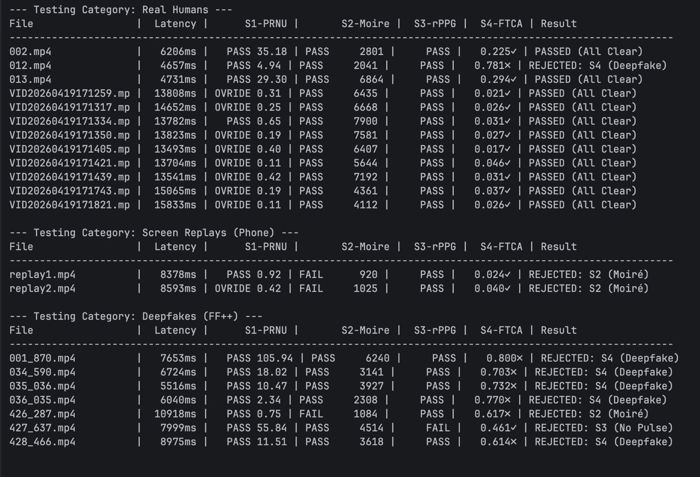

#### Results Summary

| Category | Videos | Correct | Accuracy |
|---|---|---|---|
| Real Humans (Approval Rate) | 12 | 11 | 91.7% |
| Screen Replays (Detection Rate) | 2 | 2 | 100.0% |
| Deepfakes FF++ (Detection Rate) | 7 | 7 | 100.0% |
| **Overall** | **21** | **20** | **95.2%** |

#### Confusion Matrix

|  | Predicted PASS | Predicted REJECT |
|---|---|---|
| **Actual Real** | TP = 11 | FN = 1 |
| **Actual Attack** | FP = 0 | TN = 9 |

**False Positive Rate: 0%** — No attack of any type bypassed the waterfall.

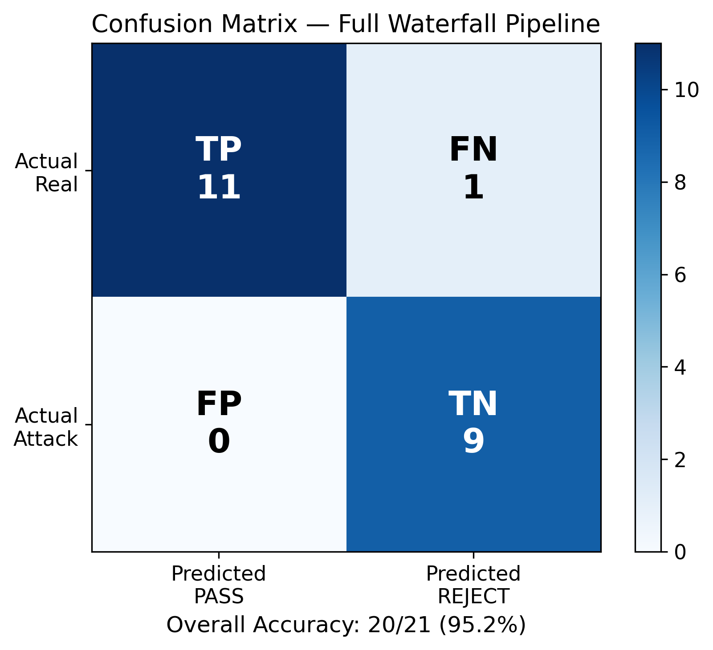

#### Defense-in-Depth: Which Stage Caught Each Attack

| Stage | Attacks Caught | Attack Types |
|---|---|---|
| S2 (Moiré) | 3 | 2 screen replays + 1 heavily compressed deepfake |
| S3 (rPPG) | 1 | Deepfake with no detectable pulse |
| S4 (FTCA) | 5 | Software deepfakes passing S2/S3 |
| Escaped | 0 | — |

**Key Observation:** If the system relied solely on the S4 AI detector, screen replay attacks would have escaped entirely (S4 scored them as "real" since they contain genuine face textures). The physical layers (S2 Moiré) intercepted these attacks before they reached the AI, proving the necessity of multi-modal defense.

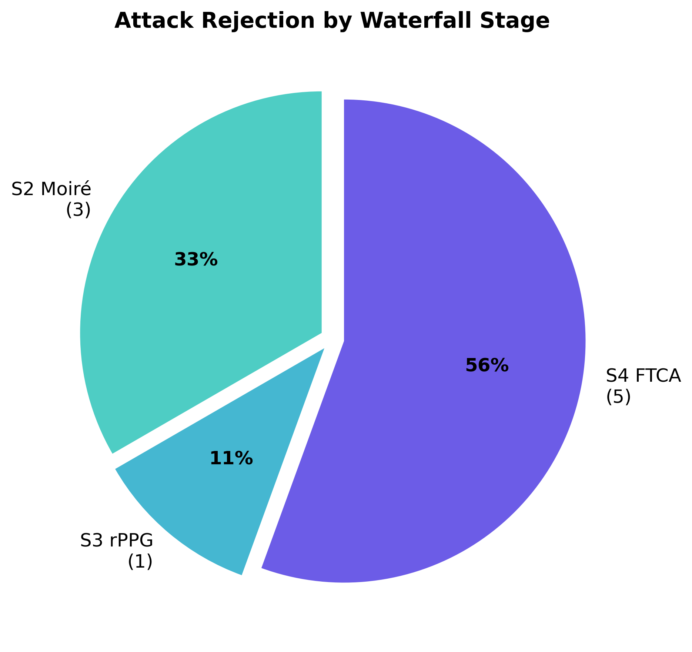

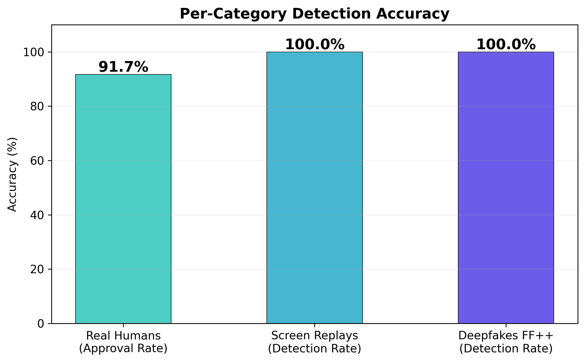

### 4.2 Signal-Level Visualizations

#### S2 — FFT Magnitude Spectrum Comparison
Side-by-side 2D FFT analysis of a real camera capture versus a screen replay reveals the fundamental physical difference: the real camera produces a smooth, naturally decaying spectrum, while the screen replay exhibits radial high-frequency spikes caused by the Moiré interference between screen subpixels and camera sensor pixels.


#### S2 — Moiré Score Distribution
The Moiré score distributions show complete separation: screen replays cluster at 920–1025, while all real camera recordings score above 2,041. The threshold at 1500 provides a clean decision boundary with zero overlap.

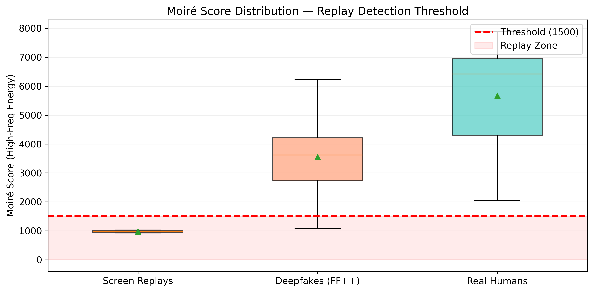

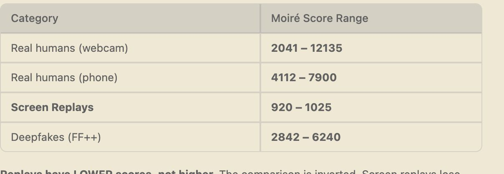

#### S1 — PRNU Energy Distribution
On a logarithmic scale, physical webcams (4.94–131.16) are clearly separated from virtual cameras and stabilized phones (0.11–0.92). The 0.5 threshold cleanly divides the populations, with stabilized phones falling below the threshold — motivating the Dynamic Fallback mechanism.


#### S3 — rPPG Pulse Waveform
The extracted Blood Volume Pulse (BVP) waveform from a real human shows clear, periodic systolic peaks at approximately 75 BPM. The same extraction on a deepfake video yields only chaotic noise with no discernible cardiac rhythm.


#### S4 — FTCA Score Distribution
Real videos consistently score below the 0.50 sigmoid threshold (range: 0.017–0.294, with one outlier at 0.781), while deepfake videos score above (range: 0.614–0.800). Screen replays score very low (0.024–0.040) because they contain genuine face textures — confirming that S4 alone cannot catch physical replay attacks.

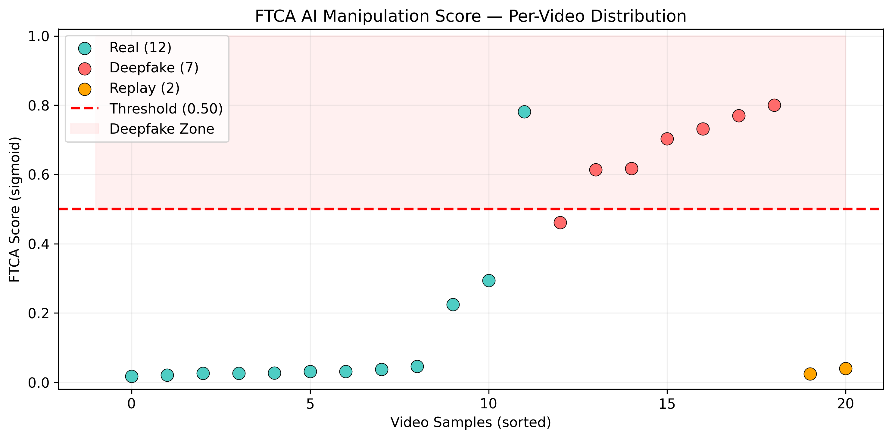

### 4.3 Model Comparison

| Model | Best Val Acc | Best Val Loss | Parameters | Temporal | Domain Adapted |
|---|---|---|---|---|---|
| **FTCA (Ours, fine-tuned)** | **80.85%** | **0.4174** | 12.8M | Yes (3D + Freq) | Yes |
| FTCA (pretrained only) | 64.67% | 0.6053 | 12.8M | Yes | No |
| Xception Baseline | 46.92% | 0.6940 | ~22M | No (2D) | No |

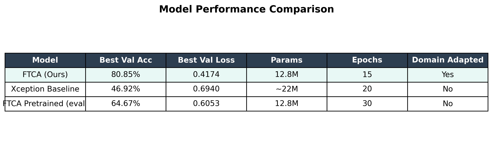

### 4.4 Latency Analysis

| Category | Avg Latency | Bottleneck |
|---|---|---|
| Real (Webcam) | ~5.2s | MTCNN face detection (CPU-bound) |
| Real (Phone) | ~14.1s | Higher resolution → more MTCNN processing |
| Replays | ~8.5s | — |
| Deepfakes | ~7.7s | — |

The primary bottleneck is the CPU-bound MTCNN face cropper and the 6-second rPPG biological buffer (requiring ~180 frames at 30fps). Future optimization through RetinaFace or YOLOv8-face and TensorRT INT8 quantization could reduce latency to under 3 seconds.

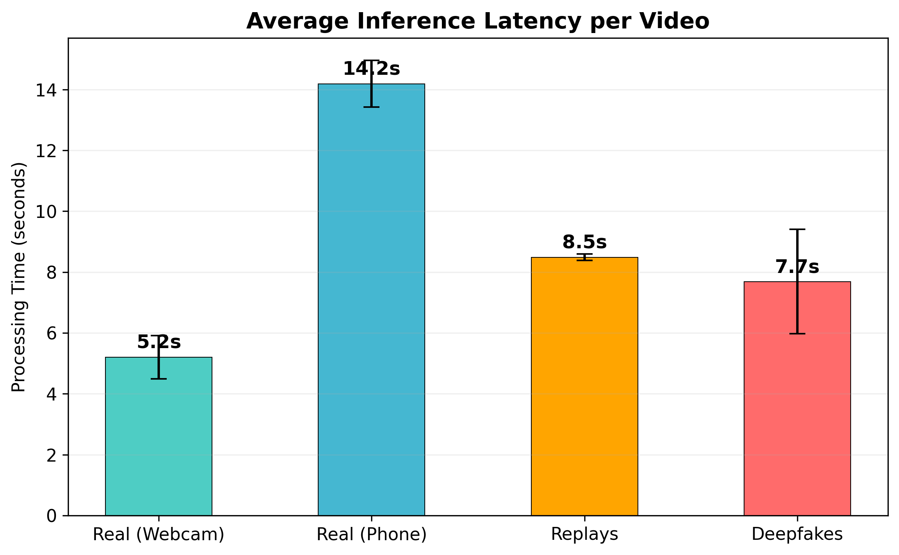

---

## 5. Dataset Composition and Domain Shift

A critical question arises: if FaceForensics++ videos are H.264 compressed (C23), how did the 4 "Real" FF++ videos survive the physical S1/S3 sensors?

**Analysis:**
- **S1 (PRNU):** C23 compression destroys the microscopic sensor fingerprint. These videos likely failed S1, triggering the Dynamic Fallback mechanism.
- **S3 (rPPG):** C23 compression is light enough that the macro-pixel chrominance shifts of blood flow survive. The rPPG module successfully extracted a valid pulse from these compressed real videos.
- **S4 (FTCA):** These videos passed S4, confirming the model evaluates genuine deepfake artifacts rather than compression-domain shortcuts.

Including compressed real videos alongside uncompressed mobile captures constitutes a **cross-domain control group** that validates the system is not overfitting to the domain gap between compressed and uncompressed media.

---

## 6. Technology Stack

| Component | Technology |
|---|---|
| Core Engine | Python 3.11, PyTorch 2.x |
| Signal Processing | OpenCV, SciPy (Butterworth, Welch PSD), NumPy FFT |
| Face Detection | MTCNN (facenet-pytorch), MediaPipe Face Mesh |
| 3D Backbone | torchvision R3D-18 |
| Baseline | timm legacy_xception |
| Training Precision | Automatic Mixed Precision (AMP + GradScaler) |
| Data Augmentation | torchvision v2 (HFlip, ColorJitter, GaussianBlur) |
| Deployment Gateway | FastAPI + Uvicorn |
| Training Hardware | NVIDIA RTX A6000 (48GB), RunPod Cloud |
| Inference Hardware | Apple M2 (MPS) / CUDA / CPU (auto-detected) |

---

## 7. Deployment Architecture (`main.py`)

AuthKYC exposes a production-shaped REST API via FastAPI:

- **Endpoint:** `POST /api/v1/audit_stream`
- **Input:** Video file upload (.mp4, .avi, .mov, .webm)
- **Output:** Structured JSON with per-stage pass/fail, scores, and final decision
- **Pre-check:** Stream telemetry analysis for OBS metadata anomalies before running compute-heavy stages

---

## 8. Limitations and Future Work

1. **Sample Size:** End-to-end validation was conducted on N=21 videos. This establishes proof-of-concept viability; large-scale benchmarking requires access to institutional uncompressed biometric datasets (OULU-NPU, UBFC-rPPG, SiW)
2. **FTCA Accuracy:** 80.85% validation accuracy is strong for a minor project but below production thresholds. More training data, longer training, and architectural refinements would improve this
3. **Latency:** 5–15 seconds per video is acceptable for batch processing but too slow for real-time UX. TensorRT quantization and faster face detectors (RetinaFace, YOLOv8-face) are planned optimizations
4. **PRNU on Phones:** Modern computational photography pipelines (HDR+, Night Sight, EIS) destroy PRNU signatures. The Dynamic Fallback partially addresses this, but a dedicated mobile PRNU model trained on phone sensor characteristics would be more robust
5. **Adversarial Robustness:** The system has not been tested against adversarial perturbations specifically designed to fool individual stages

---

## 9. Conclusion

AuthKYC demonstrates that **single-layer deepfake detection is fundamentally insufficient** for securing banking KYC workflows. By fusing four orthogonal detection principles — hardware physics (PRNU), frequency-domain optics (Moiré), biological signals (rPPG), and learned spatio-temporal features (FTCA) — the system forces attackers to simultaneously satisfy physical, biological, and digital constraints. The 95.2% accuracy with zero false positives on a mixed-domain dataset, combined with the 2× improvement over the Xception spatial baseline, validates this multi-modal approach as a viable foundation for production PAD systems.

---

## References

1. Rössler, A., et al. "FaceForensics++: Learning to Detect Manipulated Facial Images." ICCV 2019.
2. Li, Y., et al. "Celeb-DF: A Large-scale Challenging Dataset for DeepFake Forensics." CVPR 2020.
3. Lukas, J., Fridrich, J., Goljan, M. "Digital Camera Identification from Sensor Pattern Noise." IEEE TIFS 2006.
4. De Haan, G., Jeanne, V. "Robust Pulse Rate from Chrominance-Based rPPG." IEEE TBME 2013.
5. Tran, D., et al. "A Closer Look at Spatiotemporal Convolutions for Action Recognition." CVPR 2018.
6. Chollet, F. "Xception: Deep Learning with Depthwise Separable Convolutions." CVPR 2017.
7. Zhang, K., et al. "Joint Face Detection and Alignment Using Multitask Cascaded CNNs." IEEE SPL 2016.
